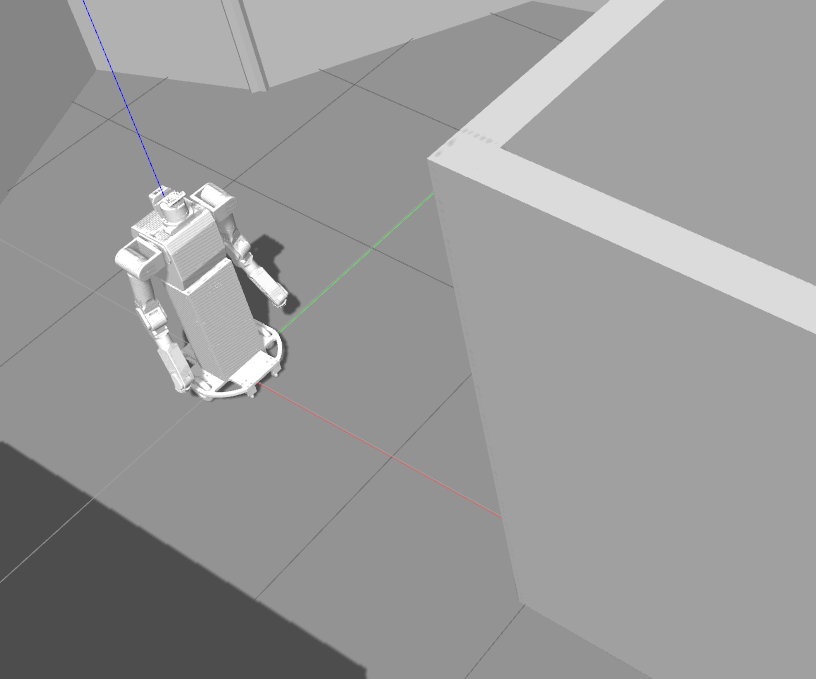
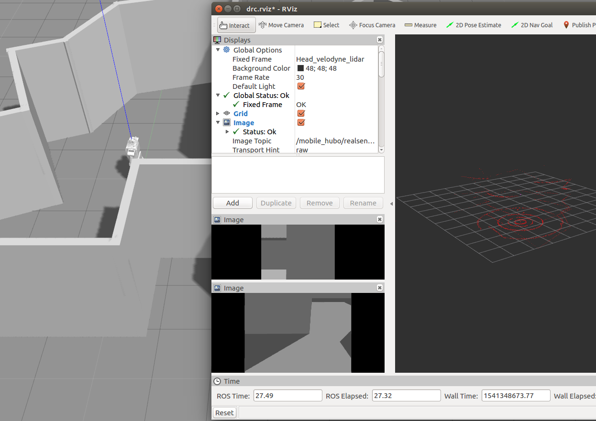

# Mobile_Hubo Simulation File 

Mobile_Hubo is a mobile_based version of DRC_HUBO with improved vision system.   <br />
Simulation file is available for KAIST Research Labs for collaboration.


### Setting up Simulation

* git clone this repository into your catkin workspace
```sh
$ cd ~/catkin_ws/src
$ git clone https://github.com/KaistInstitute/mobile_hubo_simulation.git
```

* copy the folders in model directory under gazebo directory
```sh
$ cd mobile_hubo_simulation/models
$ mv * ~/.gazebo/models
```

* build
```sh
$ cd ~/catkin_ws
$ catkin_make
```

* install gazebo plugins
```sh
$ sudo apt-get install ros-kinetic-velodyne-gazebo-plugins
$ cd ~/catkin_ws
$ catkin_make
```


### Running Simulation
* Open terminal and launch gazebo file

```sh
$ roslaunch mobile_hubo_ow mobile_hubo_ow.launch
```

* Confirm that the robot is spawned correctly in Gazebo 



* open a new tab to confirm sensor data (example: lidar) is being published

```sh
$ rostopic list
$ rostopic echo /mobile_hubo/lidar/velodyne_points
```

* look at sensor data through Rviz program




Maintainers
----

KAIST HUBO LABS - ML634@kaist.ac.kr
